<h1>Fradulent Transactions   (Classification of Imbalanced Dataset)</h1>
<h2 id="introduction">Introduction</h2>
<ul>
<li>
FRAUDULENT TRANSACTIONS is a case of imbalanced dataset. Imbalanced dataset are the dataset where the presence of once class is very high compared to the second class. For example spame data for email.
</li>
<li>
The issue with imbalanced data is that most of the classification algorithms are designed for approximately equal sample of both classes.
</li>
<li>
For example if we take case of credit card transanctions, maximum 2-3 out of 100 transactions will be fraud. In this case if I do nothing still the accuracy for zero lable is 96% which is very high.
</li>
<li>
Some classifiers are created in this project for FRAUDULENT TRANSACTIONS and compared. The dataset used for this project is downloaded from <a href="https://www.kaggle.com/datasets/vardhansiramdasu/fraudulent-transactions-prediction">Kaggle</a>.
</li>
<li>
Outline of the Project is

<ul>
<li>General overview of the data</li>
<li>Visualization</li>
<li>Issues with the Default classifier</li>
<li>Classification using resampling
<ul>
<li>Resampling</li>
<li>Visualization</li>
<li>Model pipeline</li>
<li>Classificassion</li>
<li>Results</li>
</ul></li>
<li>Conclusion</li>
</ul></li>
</ul>
<section id="general-overview-of-the-data" class="cell markdown" id="oAhetDPLsXi9">
<h1>General overview of the data</h1>
</section>

<pre class="sourceCode python"><code class="sourceCode python"># Importing the required Libraries
import numpy  as np
import pandas as pd
import matplotlib.pyplot as plt
import seaborn as sns
import warnings
warnings.filterwarnings(&#39;ignore&#39;)</code></pre>

<pre class="sourceCode python"><code class="sourceCode python"># Importing the data and general information
df = pd.read_csv(&#39;Fraud.csv&#39;)
df.info()</code></pre>

<pre><code>&lt;class &#39;pandas.core.frame.DataFrame&#39;&gt;
RangeIndex: 6362620 entries, 0 to 6362619
Data columns (total 11 columns):
 #   Column          Dtype  
---  ------          -----  
 0   step            int64  
 1   type            object 
 2   amount          float64
 3   nameOrig        object 
 4   oldbalanceOrg   float64
 5   newbalanceOrig  float64
 6   nameDest        object 
 7   oldbalanceDest  float64
 8   newbalanceDest  float64
 9   isFraud         int64  
 10  isFlaggedFraud  int64  
dtypes: float64(5), int64(3), object(3)
memory usage: 534.0+ MB
</code></pre>

<pre class="sourceCode python"><code class="sourceCode python"># general view
df.head(5)</code></pre>

  

    

      

<table border="1" class="dataframe">
  <thead>
    <tr style="text-align: right;">
      <th></th>
      <th>step</th>
      <th>type</th>
      <th>amount</th>
      <th>nameOrig</th>
      <th>oldbalanceOrg</th>
      <th>newbalanceOrig</th>
      <th>nameDest</th>
      <th>oldbalanceDest</th>
      <th>newbalanceDest</th>
      <th>isFraud</th>
      <th>isFlaggedFraud</th>
    </tr>
  </thead>
  <tbody>
    <tr>
      <th>0</th>
      <td>1</td>
      <td>PAYMENT</td>
      <td>9839.64</td>
      <td>C1231006815</td>
      <td>170136.0</td>
      <td>160296.36</td>
      <td>M1979787155</td>
      <td>0.0</td>
      <td>0.0</td>
      <td>0</td>
      <td>0</td>
    </tr>
    <tr>
      <th>1</th>
      <td>1</td>
      <td>PAYMENT</td>
      <td>1864.28</td>
      <td>C1666544295</td>
      <td>21249.0</td>
      <td>19384.72</td>
      <td>M2044282225</td>
      <td>0.0</td>
      <td>0.0</td>
      <td>0</td>
      <td>0</td>
    </tr>
    <tr>
      <th>2</th>
      <td>1</td>
      <td>TRANSFER</td>
      <td>181.00</td>
      <td>C1305486145</td>
      <td>181.0</td>
      <td>0.00</td>
      <td>C553264065</td>
      <td>0.0</td>
      <td>0.0</td>
      <td>1</td>
      <td>0</td>
    </tr>
    <tr>
      <th>3</th>
      <td>1</td>
      <td>CASH_OUT</td>
      <td>181.00</td>
      <td>C840083671</td>
      <td>181.0</td>
      <td>0.00</td>
      <td>C38997010</td>
      <td>21182.0</td>
      <td>0.0</td>
      <td>1</td>
      <td>0</td>
    </tr>
    <tr>
      <th>4</th>
      <td>1</td>
      <td>PAYMENT</td>
      <td>11668.14</td>
      <td>C2048537720</td>
      <td>41554.0</td>
      <td>29885.86</td>
      <td>M1230701703</td>
      <td>0.0</td>
      <td>0.0</td>
      <td>0</td>
      <td>0</td>
    </tr>
  </tbody>
</table>

      <button class="colab-df-convert" onclick="convertToInteractive('df-95163111-618c-4c00-bbdd-c4f15554a89a')"
              title="Convert this dataframe to an interactive table."
              style="display:none;">
        
  <svg xmlns="http://www.w3.org/2000/svg" height="24px"viewBox="0 0 24 24"
       width="24px">
    <path d="M0 0h24v24H0V0z" fill="none"/>
    <path d="M18.56 5.44l.94 2.06.94-2.06 2.06-.94-2.06-.94-.94-2.06-.94 2.06-2.06.94zm-11 1L8.5 8.5l.94-2.06 2.06-.94-2.06-.94L8.5 2.5l-.94 2.06-2.06.94zm10 10l.94 2.06.94-2.06 2.06-.94-2.06-.94-.94-2.06-.94 2.06-2.06.94z"/><path d="M17.41 7.96l-1.37-1.37c-.4-.4-.92-.59-1.43-.59-.52 0-1.04.2-1.43.59L10.3 9.45l-7.72 7.72c-.78.78-.78 2.05 0 2.83L4 21.41c.39.39.9.59 1.41.59.51 0 1.02-.2 1.41-.59l7.78-7.78 2.81-2.81c.8-.78.8-2.07 0-2.86zM5.41 20L4 18.59l7.72-7.72 1.47 1.35L5.41 20z"/>
  </svg>
      </button>
      
  

      
    

  

  

<pre class="sourceCode python"><code class="sourceCode python"># General view of the data lables
plt.style.use(&#39;dark_background&#39;)
fig = plt.gcf()
fig.set_size_inches(10, 6)
sns.scatterplot(x = &#39;oldbalanceOrg&#39;, y = &#39;newbalanceDest&#39;, data = df[df[&#39;isFraud&#39;] == 1], color = &#39;red&#39;, label = &#39;Fraud&#39;, marker = &#39;*&#39;);
sns.scatterplot(x = &#39;oldbalanceOrg&#39;, y = &#39;newbalanceDest&#39;, data = df[df[&#39;isFraud&#39;] == 0], color = &#39;green&#39;, label = &#39;non-Fraud&#39;, marker = &#39;+&#39;);
plt.legend()
plt.show()</code></pre>

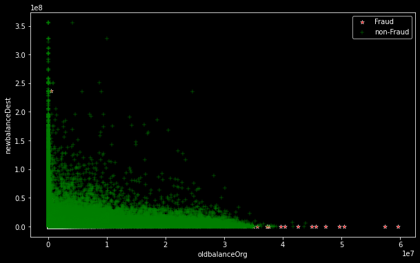

<pre class="sourceCode python"><code class="sourceCode python"># Transaction labels 
print(&#39;Number of fraud Transactions = &#39;, df[df[&#39;isFraud&#39;] == 1].shape[0])
print(&#39;Number of non-fraud Transactions = &#39;, df[df[&#39;isFraud&#39;] == 0].shape[0])
sns.countplot(x = &#39;isFraud&#39;, data = df);</code></pre>

<pre><code>Number of fraud Transactions =  8213
Number of non-fraud Transactions =  6354407
</code></pre>

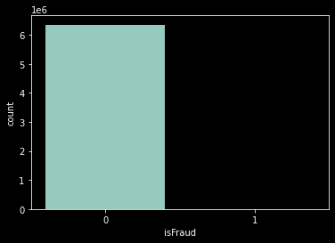

<ul>
<li>Here we can see that out 6362620 transactions, only 8213 (around 0.13 %) are fraud. If we just do the count plot, the fraud transaction is not even visible.</li>
<li>This is clearly an example of imbalanced dataset.</li>
<li>The data has 11 columns in which isFraud is the target column. In remaining columns, nameOrig and nameDest are not relevent features as they are the name of id of the costomures.</li>
<li>Column isFlagFraud contains 1, for all the transaction which are more than 200 dollars otherwise 0. Again this is not relevant for us.</li>
</ul>

<pre class="sourceCode python"><code class="sourceCode python"># checking for nans
df.isna().sum()</code></pre>

<pre><code>step              0
type              0
amount            0
nameOrig          0
oldbalanceOrg     0
newbalanceOrig    0
nameDest          0
oldbalanceDest    0
newbalanceDest    0
isFraud           0
isFlaggedFraud    0
dtype: int64</code></pre>

<ul>
<li>It is clear that all the features have the correct data type with zero nans.</li>
<li>As we can see there are 6362620 samples in this data which is a quite high number. For simplicity we will use some randomaly generated samples.</li>
</ul>

<section id="visualization" class="cell markdown" id="Cnn6r_O1zKYL">
<h1>Visualization</h1>
</section>

<pre class="sourceCode python"><code class="sourceCode python"># Getting a sample of 5000 and saving it for future reference
df_vis= df.sample(5000, random_state = 0)
df_vis.to_csv(&#39;df_vis.csv&#39;)</code></pre>

<pre class="sourceCode python"><code class="sourceCode python">df_vis = pd.read_csv(&#39;df_vis.csv&#39;)</code></pre>

<section id="does-the-fraud-transactions-happen-for-high-amount-if-yes-then-which-mode-is-being-used" class="cell markdown" id="xHoPgqXXzOqh">
<h2>Does the fraud transactions happen for high amount? If yes then which mode is being used?</h2>
</section>

<pre class="sourceCode python"><code class="sourceCode python">sns.swarmplot(x = &#39;type&#39;, y = &#39;amount&#39;, hue = &#39;isFraud&#39;, data = df_vis);</code></pre>

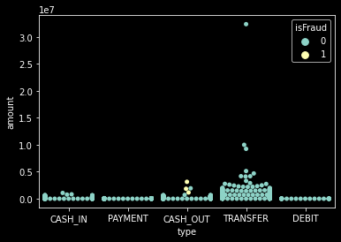

<ul>
<li>Commenting about the transactions is hard here.</li>
<li>Other thing to notice is that most of the transaction are being transfered specially high amount transactions.</li>
<li>It is also intutive that the fraud transactions are mostly done by cashind out the money.</li>
</ul>

<section id="does-the-balance-in-acount-lead-towards-fraud-transactions-if-yes-then-how-much-amount" class="cell markdown" id="XjPvqCJK3oUQ">
<h2>Does the balance in acount lead towards fraud transactions? If yes then how much amount?</h2>
</section>

<pre class="sourceCode python"><code class="sourceCode python">sns.scatterplot(x = &#39;oldbalanceOrg&#39;, y = &#39;amount&#39;, hue = &#39;isFraud&#39;, data = df_vis);</code></pre>

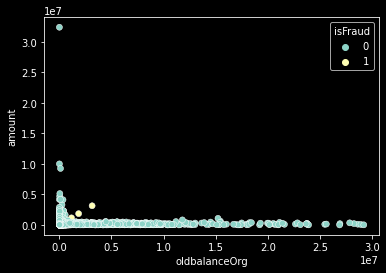

<ul>
<li>From the above graph it is clear that Fraud does not happen only for customers who have high balance in the account.</li>
</ul>

<section id="skewness-in-the-data" class="cell markdown" id="VUooNyim9dWt">
<h2>Skewness in the data</h2>
</section>

<pre class="sourceCode python"><code class="sourceCode python">for col in [&#39;amount&#39;,&#39;oldbalanceOrg&#39;, &#39;newbalanceOrig&#39;, &#39;oldbalanceDest&#39;, &#39;newbalanceDest&#39;]:
  sns.boxenplot(x=col, data = df_vis);
  plt.show()
  print(col,&#39;\n&#39;)
 </code></pre>

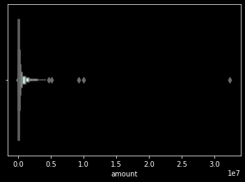

<pre><code>amount 

</code></pre>

<pre><code>oldbalanceOrg 

</code></pre>

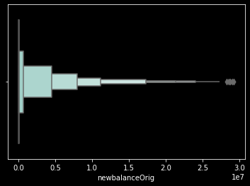

<pre><code>newbalanceOrig 

</code></pre>

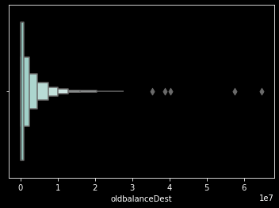

<pre><code>oldbalanceDest 

</code></pre>

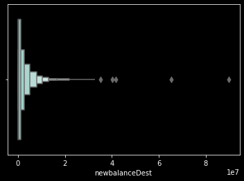

<pre><code>newbalanceDest 

</code></pre>

<ul>
<li>All the numeric features are highly right skewed and log transformation of the data will be required.</li>
<li>It is also fact that most of the accounts have less amount of money and it can be seen from the pictures.</li>
</ul>

<section id="issues-with-default-classifier-for-imbalanced-data" class="cell markdown" id="0t4-hOrj68e8">
<h1>Issues with default classifier for imbalanced data</h1>
</section>

Let us create a some classifier to see the performance without changing anything.

<section id="default-classfiers" class="cell markdown" id="vvZ09KOd7E2m">
<h2>Default Classfiers</h2>
</section>

<pre class="sourceCode python"><code class="sourceCode python"># copy of data to check the performance
df_def = df.copy()

# Droping non requiered features
df_def = df_def.drop([&#39;nameOrig&#39;, &#39;nameDest&#39;, &#39;isFlaggedFraud&#39;], axis = 1)

# Encoding categorical variables
df_def = pd.get_dummies(df_def)</code></pre>

<pre class="sourceCode python"><code class="sourceCode python"># log transformation of skewed fetures
sfeature = [&#39;amount&#39;,&#39;oldbalanceOrg&#39;, &#39;newbalanceOrig&#39;, &#39;oldbalanceDest&#39;, &#39;newbalanceDest&#39;]
df_def[sfeature] = np.log(df_def[sfeature] + 1)
df_def.head()</code></pre>

  

    

      

<table border="1" class="dataframe">
  <thead>
    <tr style="text-align: right;">
      <th></th>
      <th>step</th>
      <th>amount</th>
      <th>oldbalanceOrg</th>
      <th>newbalanceOrig</th>
      <th>oldbalanceDest</th>
      <th>newbalanceDest</th>
      <th>isFraud</th>
      <th>type_CASH_IN</th>
      <th>type_CASH_OUT</th>
      <th>type_DEBIT</th>
      <th>type_PAYMENT</th>
      <th>type_TRANSFER</th>
    </tr>
  </thead>
  <tbody>
    <tr>
      <th>0</th>
      <td>1</td>
      <td>9.194276</td>
      <td>12.044359</td>
      <td>11.984786</td>
      <td>0.000000</td>
      <td>0.0</td>
      <td>0</td>
      <td>0</td>
      <td>0</td>
      <td>0</td>
      <td>1</td>
      <td>0</td>
    </tr>
    <tr>
      <th>1</th>
      <td>1</td>
      <td>7.531166</td>
      <td>9.964112</td>
      <td>9.872292</td>
      <td>0.000000</td>
      <td>0.0</td>
      <td>0</td>
      <td>0</td>
      <td>0</td>
      <td>0</td>
      <td>1</td>
      <td>0</td>
    </tr>
    <tr>
      <th>2</th>
      <td>1</td>
      <td>5.204007</td>
      <td>5.204007</td>
      <td>0.000000</td>
      <td>0.000000</td>
      <td>0.0</td>
      <td>1</td>
      <td>0</td>
      <td>0</td>
      <td>0</td>
      <td>0</td>
      <td>1</td>
    </tr>
    <tr>
      <th>3</th>
      <td>1</td>
      <td>5.204007</td>
      <td>5.204007</td>
      <td>0.000000</td>
      <td>9.960954</td>
      <td>0.0</td>
      <td>1</td>
      <td>0</td>
      <td>1</td>
      <td>0</td>
      <td>0</td>
      <td>0</td>
    </tr>
    <tr>
      <th>4</th>
      <td>1</td>
      <td>9.364703</td>
      <td>10.634773</td>
      <td>10.305174</td>
      <td>0.000000</td>
      <td>0.0</td>
      <td>0</td>
      <td>0</td>
      <td>0</td>
      <td>0</td>
      <td>1</td>
      <td>0</td>
    </tr>
  </tbody>
</table>

      <button class="colab-df-convert" onclick="convertToInteractive('df-3396e7dc-4825-4776-a1d3-59b0b0905f0f')"
              title="Convert this dataframe to an interactive table."
              style="display:none;">
        
  <svg xmlns="http://www.w3.org/2000/svg" height="24px"viewBox="0 0 24 24"
       width="24px">
    <path d="M0 0h24v24H0V0z" fill="none"/>
    <path d="M18.56 5.44l.94 2.06.94-2.06 2.06-.94-2.06-.94-.94-2.06-.94 2.06-2.06.94zm-11 1L8.5 8.5l.94-2.06 2.06-.94-2.06-.94L8.5 2.5l-.94 2.06-2.06.94zm10 10l.94 2.06.94-2.06 2.06-.94-2.06-.94-.94-2.06-.94 2.06-2.06.94z"/><path d="M17.41 7.96l-1.37-1.37c-.4-.4-.92-.59-1.43-.59-.52 0-1.04.2-1.43.59L10.3 9.45l-7.72 7.72c-.78.78-.78 2.05 0 2.83L4 21.41c.39.39.9.59 1.41.59.51 0 1.02-.2 1.41-.59l7.78-7.78 2.81-2.81c.8-.78.8-2.07 0-2.86zM5.41 20L4 18.59l7.72-7.72 1.47 1.35L5.41 20z"/>
  </svg>
      </button>
      
  

      
    

  

  

<section id="model-pipeline" class="cell markdown" id="GgxuDO7LJD9a">
<h3>Model Pipeline</h3>
</section>

<pre class="sourceCode python"><code class="sourceCode python"># features and target
features = df_def.drop(&#39;isFraud&#39;, axis = True)
target = df_def[&#39;isFraud&#39;]

# Splitting the train and test data
from sklearn.model_selection import train_test_split
xtrain, xtest, ytrain, ytest = train_test_split(features, target, test_size = 0.3, random_state = 0)

# Importing the classifiers
from sklearn.linear_model import LogisticRegression
from sklearn.ensemble import RandomForestClassifier
from sklearn.naive_bayes import GaussianNB

# Performace metircs
from sklearn.metrics import accuracy_score, confusion_matrix, ConfusionMatrixDisplay, classification_report

def performace(xtrain, ytrain, xtest, ytest, classifier):
  ypred = classifier.predict(xtest)
  report = classification_report(ytest,ypred)
  cm = confusion_matrix(ytest,ypred)
  print(report)
  disp = ConfusionMatrixDisplay(confusion_matrix = cm)
  disp.plot()
  plt.show()

  # Result
for classifier in [LogisticRegression(random_state = 0), RandomForestClassifier(random_state = 0), GaussianNB()]:
  classifier.fit(xtrain, ytrain)
  print(classifier)
  performace(xtrain, ytrain, xtest, ytest, classifier)</code></pre>

<pre><code>LogisticRegression(random_state=0)
              precision    recall  f1-score   support

           0       1.00      1.00      1.00   1906367
           1       0.86      0.48      0.62      2419

    accuracy                           1.00   1908786
   macro avg       0.93      0.74      0.81   1908786
weighted avg       1.00      1.00      1.00   1908786

</code></pre>

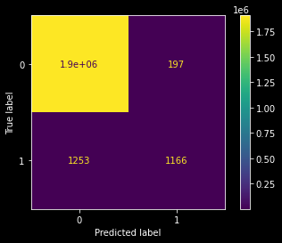

<pre><code>RandomForestClassifier(random_state=0)
              precision    recall  f1-score   support

           0       1.00      1.00      1.00   1906367
           1       0.98      0.79      0.88      2419

    accuracy                           1.00   1908786
   macro avg       0.99      0.90      0.94   1908786
weighted avg       1.00      1.00      1.00   1908786

</code></pre>

<pre><code>GaussianNB()
              precision    recall  f1-score   support

           0       1.00      0.82      0.90   1906367
           1       0.01      0.97      0.01      2419

    accuracy                           0.82   1908786
   macro avg       0.50      0.89      0.46   1908786
weighted avg       1.00      0.82      0.90   1908786

</code></pre>

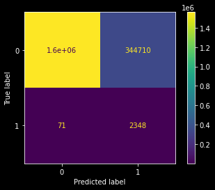

<ul>
<li>
It is quite clear that in the case of every classifier used above the classification for 0 label (non-fraud transaction) is very good. But in the opposite the classification of class label 1 (fraud transactions) is very bad, which is not acceptable.
</li>
<li>
For example in the case of Logistic regression classifier (f-1 scores = 0.62), 2419 samples are actually labeled 1. But out of 2419 samples, 1253 (more than half) are misclassified. But this situation is not happening for class zero.
</li>
<li>
Gaussian Naive Bayes classifier has classified class 1 with a very high accuracy but it also has classified many lables as 1 which were 0 in actual. Because of this the f-1 score has reduced to 0.01 which is much much lower than that of other two classifier.
</li>
</ul>

<section id="classification-with-resampling" class="cell markdown" id="6TWCdjyNGu2L">
<h1>Classification with resampling</h1>
</section>
<section id="resampling" class="cell markdown" id="SkPovVM-JP1L">
<h2>Resampling</h2>
</section>

Resampling can be done in two ways:

<ul>
<li>
Over sampling - Creating duplicates of class 1 to make number of both the class samples equal. Therefore, total number of rows will be the twice of the samples supporting class 0 (i.e., more than original number of samples)
</li>
<li>
Under sampling - Dropping random samples supporting class 0 to make number of both the class samples equal. Therefore, total number of rows will be the twice of the samples supporting class 1 (i.e., Much less than the original number of samples)
</li>
<li>
As the dataframe has a lot of rows, Undersampling will be a better choice.
</li>
</ul>

<section id="undersampling-resampling" class="cell markdown" id="iS8NPkYHH4uw">
<h2>Undersampling (Resampling)</h2>
</section>

<pre class="sourceCode python"><code class="sourceCode python"># selecting the class 1 samples
df1 = df[df[&#39;isFraud&#39;] == 1]

# Selectiong the equal number of random class 0 samples
df0 = df[df[&#39;isFraud&#39;] == 0].sample(df1.shape[0])

# Merging to get the final data framd
df_und_sam = pd.concat([df1, df0])

# Saving it for future refrence
df_und_sam.to_csv(&#39;Under_sampled_data.csv&#39;)</code></pre>

<pre class="sourceCode python"><code class="sourceCode python">df = pd.read_csv(&#39;Under_sampled_data.csv&#39;)
df.info()</code></pre>

<pre><code>&lt;class &#39;pandas.core.frame.DataFrame&#39;&gt;
RangeIndex: 16426 entries, 0 to 16425
Data columns (total 12 columns):
 #   Column          Non-Null Count  Dtype  
---  ------          --------------  -----  
 0   Unnamed: 0      16426 non-null  int64  
 1   step            16426 non-null  int64  
 2   type            16426 non-null  object 
 3   amount          16426 non-null  float64
 4   nameOrig        16426 non-null  object 
 5   oldbalanceOrg   16426 non-null  float64
 6   newbalanceOrig  16426 non-null  float64
 7   nameDest        16426 non-null  object 
 8   oldbalanceDest  16426 non-null  float64
 9   newbalanceDest  16426 non-null  float64
 10  isFraud         16426 non-null  int64  
 11  isFlaggedFraud  16426 non-null  int64  
dtypes: float64(5), int64(4), object(3)
memory usage: 1.5+ MB
</code></pre>

<ul>
<li>Total number of samples in resampled dataframe 16426 which is twice of the number of samples supporting class 1.</li>
</ul>

<pre class="sourceCode python"><code class="sourceCode python"># General view of the data
plt.style.use(&#39;dark_background&#39;)
fig = plt.gcf()
fig.set_size_inches(5, 5)
sns.scatterplot(x = &#39;oldbalanceOrg&#39;, y = &#39;newbalanceDest&#39;, data = df[df[&#39;isFraud&#39;] == 1], color = &#39;red&#39;, label = &#39;Fraud&#39;, marker = &#39;*&#39;);
sns.scatterplot(x = &#39;oldbalanceOrg&#39;, y = &#39;newbalanceDest&#39;, data = df[df[&#39;isFraud&#39;] == 0], color = &#39;green&#39;, label = &#39;non-Fraud&#39;, marker = &#39;+&#39;);
plt.ylim(-0.01*(10**8), 0.5*(10**8))
plt.legend()
plt.show()</code></pre>

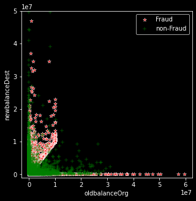

<ul>
<li>Now visual of fraud transactions is much clear compared to earlier.</li>
</ul>

<section id="visualization" class="cell markdown" id="KWEe55IO8OcP">
<h2>Visualization</h2>
</section>

<pre class="sourceCode python"><code class="sourceCode python"># Amount Vs transaction type
sns.swarmplot(x = &#39;type&#39;, y = &#39;amount&#39;, data = df.sample(1000), hue=&#39;isFraud&#39;);</code></pre>

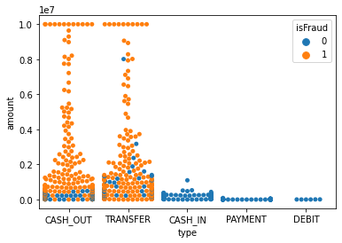

<ul>
<li>If we can clearly see that the most of the fraud transactions are either done by cashing it out or by transfering to another account.</li>
</ul>

<pre class="sourceCode python"><code class="sourceCode python"># Skewness in the numerical features
for col in [&#39;amount&#39;,&#39;oldbalanceOrg&#39;, &#39;newbalanceOrig&#39;, &#39;oldbalanceDest&#39;, &#39;newbalanceDest&#39;]:
  sns.boxenplot(x=col, data = df);
  plt.show()
  print(col,&#39;\n&#39;)</code></pre>

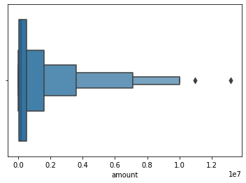

<pre><code>amount 

</code></pre>

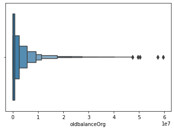

<pre><code>oldbalanceOrg 

</code></pre>

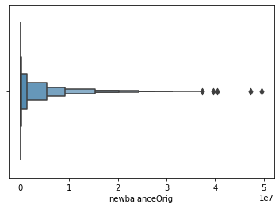

<pre><code>newbalanceOrig 

</code></pre>

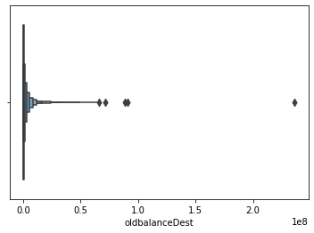

<pre><code>oldbalanceDest 

</code></pre>

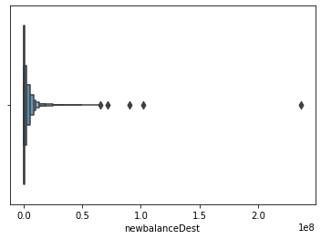

<pre><code>newbalanceDest 

</code></pre>

<section id="data-processing" class="cell markdown" id="w9C3nSySWyfj">
<h2>Data processing</h2>
</section>

<pre class="sourceCode python"><code class="sourceCode python"># Droping non requiered features
df = df.drop([&#39;nameOrig&#39;, &#39;nameDest&#39;, &#39;isFlaggedFraud&#39;], axis = 1)

# Encoding categorical variables
df = pd.get_dummies(df)

# log transformation of skewed fetures
sfeature = [&#39;amount&#39;,&#39;oldbalanceOrg&#39;, &#39;newbalanceOrig&#39;, &#39;oldbalanceDest&#39;, &#39;newbalanceDest&#39;]
df[sfeature] = np.log(df[sfeature] + 1)</code></pre>

<section id="model-pipeling" class="cell markdown" id="qeIGcMtBX-GD">
<h2>Model Pipeling</h2>
</section>

<pre class="sourceCode python"><code class="sourceCode python"># features and target
features = df.drop(&#39;isFraud&#39;, axis = True)
target = df[&#39;isFraud&#39;]

# Splitting the train and test data
from sklearn.model_selection import train_test_split
xtrain, xtest, ytrain, ytest = train_test_split(features, target, test_size = 0.3, random_state = 0)

# Classifiers
from sklearn.linear_model import LogisticRegression
from sklearn.ensemble import RandomForestClassifier
from sklearn.naive_bayes import GaussianNB

# Performace metircs
from sklearn.metrics import accuracy_score, confusion_matrix, ConfusionMatrixDisplay, classification_report

def performace(xtrain, ytrain, xtest, ytest, classifier):
  ypred = classifier.predict(xtest)
  report = classification_report(ytest,ypred)
  cm = confusion_matrix(ytest,ypred)
  print(report)
  disp = ConfusionMatrixDisplay(confusion_matrix = cm)
  disp.plot()
  plt.show()

# Result
for classifier in [LogisticRegression(random_state = 0), RandomForestClassifier(random_state = 0), GaussianNB()]:
  classifier.fit(xtrain, ytrain)
  print(classifier)
  performace(xtrain, ytrain, xtest, ytest, classifier)</code></pre>

<pre><code>LogisticRegression(random_state=0)
              precision    recall  f1-score   support

           0       0.00      0.00      0.00      2490
           1       0.49      1.00      0.66      2438

    accuracy                           0.49      4928
   macro avg       0.25      0.50      0.33      4928
weighted avg       0.24      0.49      0.33      4928

</code></pre>

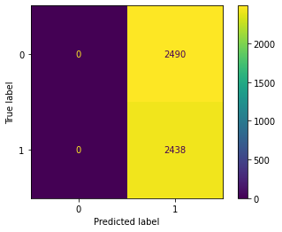

<pre><code>
RandomForestClassifier(random_state=0)
              precision    recall  f1-score   support

           0       0.99      0.99      0.99      2490
           1       0.99      0.99      0.99      2438

    accuracy                           0.99      4928
   macro avg       0.99      0.99      0.99      4928
weighted avg       0.99      0.99      0.99      4928

</code></pre>

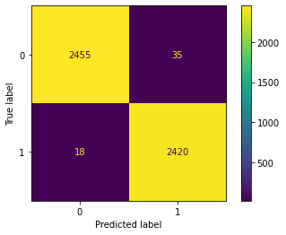

<pre><code>
GaussianNB()
              precision    recall  f1-score   support

           0       0.63      0.74      0.68      2490
           1       0.68      0.56      0.62      2438

    accuracy                           0.65      4928
   macro avg       0.66      0.65      0.65      4928
weighted avg       0.66      0.65      0.65      4928

</code></pre>

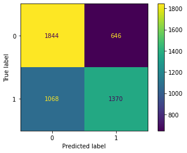

<pre><code>
</code></pre>

<section id="conclusion" class="cell markdown" id="5WeXE5FgYqTR">
<h1>Conclusion</h1>
</section>

<ul>
<li>
Out of three classfiers, Random Forest classifier is working best before and after reshampling. It is also clear that it is working much better after resampling.
</li>
<li>
Logistic regression classifier was baised towards the 0 leble before resampling and it became biased towards label 1 after resampling (under sampling leads to loose a lot of valuable information)
</li>
<li>
Gaussian Naive Bayes classifier's is performing better after resampling.
</li>
<li>
f1-score of every classifier is increased for every classifier.
</li>
<li>
As this is the case of fraud detection, detecting of a fraud transactions as non-fraud is worse than detecting of a non-fraud transacation as fraud.
</li>
</ul>

